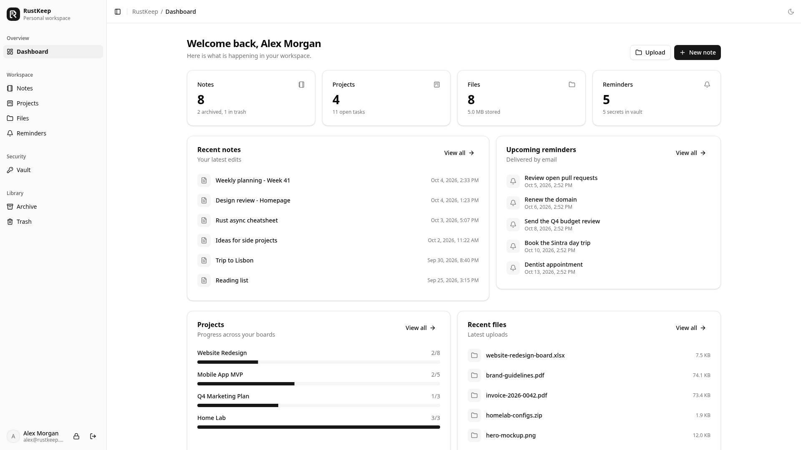
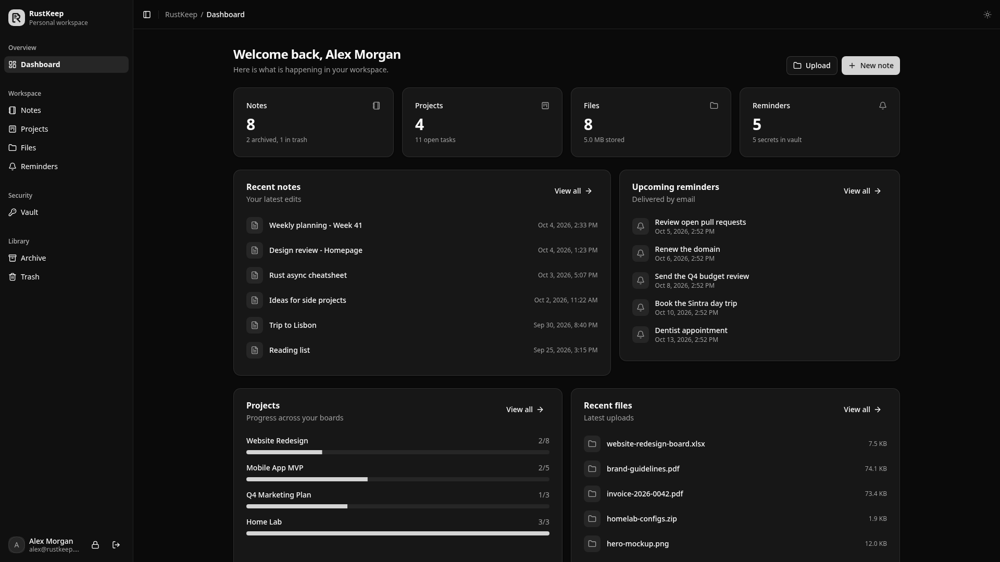
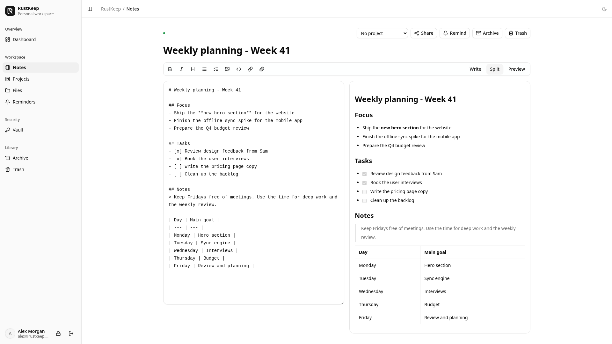
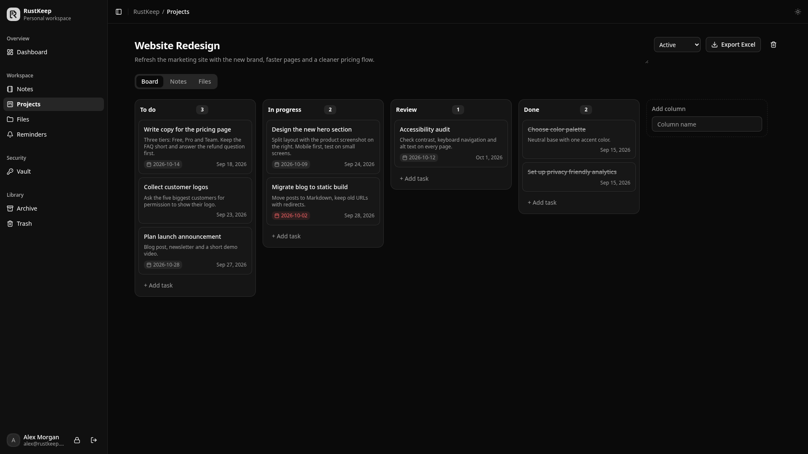
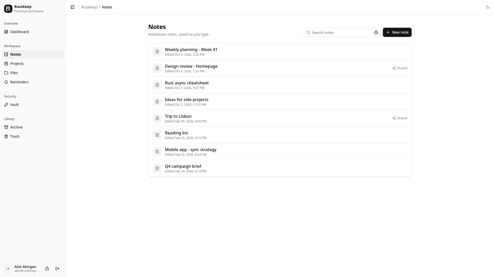
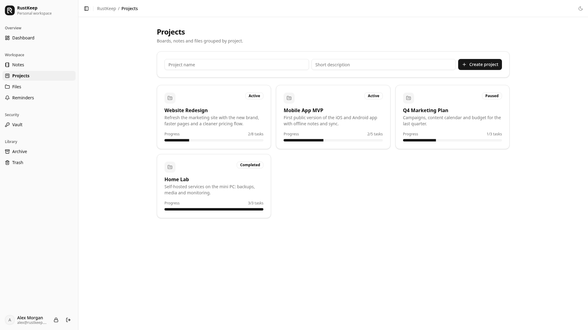
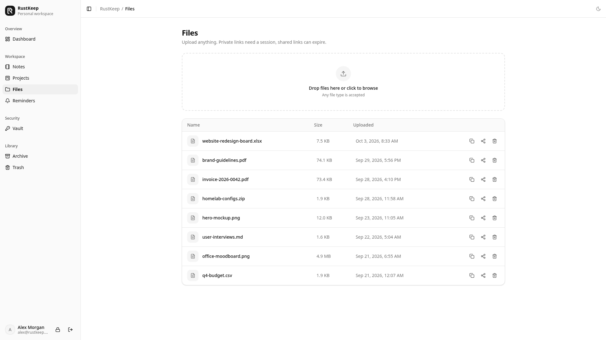
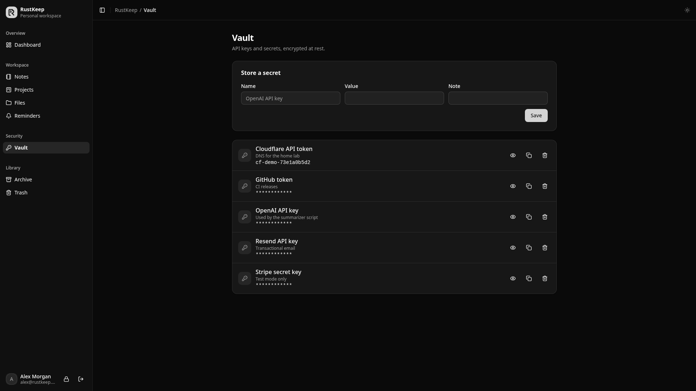
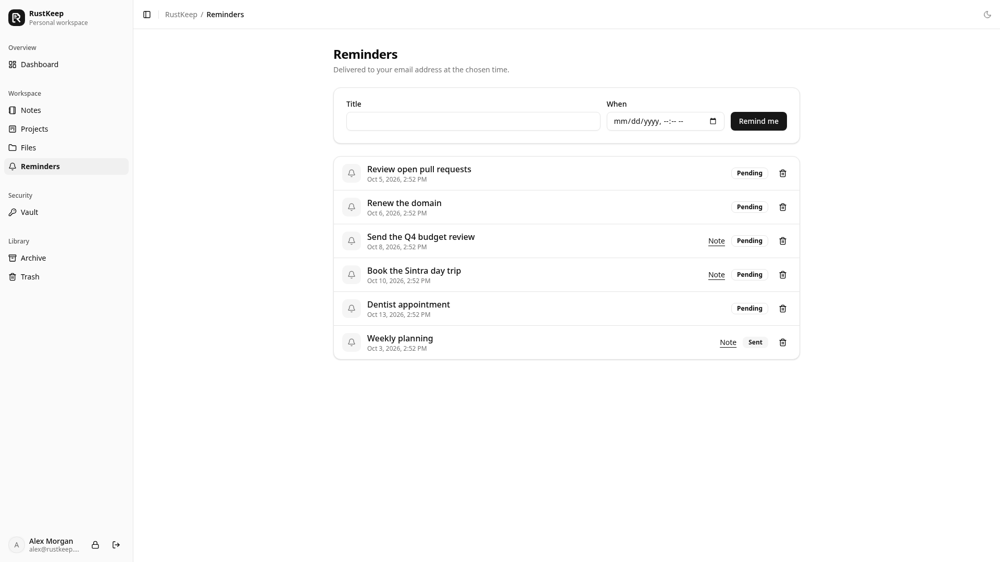
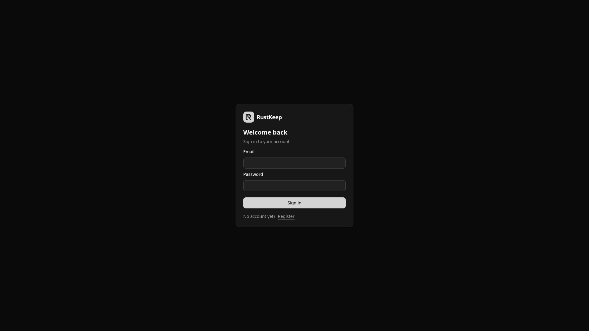

<p align="center"></p>

# RustKeep

Self-hosted notes, files, API key vault, reminders and lightweight project boards.

- `./` - server: axum + libSQL (local SQLite file or Turso), single-threaded tokio runtime.
- `web/` - client: Leptos CSR (nightly) with [rust-ui](https://github.com/rust-ui/ui) components and Tailwind v4.

## Screenshots

**Dashboard** - summary of notes, projects, files and reminders



**Dashboard in dark mode**



**Markdown editor** - split view with live preview, saved as you type



**Project board** - custom columns, due dates and descriptions on every card



<table>
  <tr>
    <td><b>Notes</b><br></td>
    <td><b>Projects</b><br></td>
  </tr>
  <tr>
    <td><b>Files</b><br></td>
    <td><b>Vault (PIN protected)</b><br></td>
  </tr>
  <tr>
    <td><b>Reminders</b><br></td>
    <td><b>Sign in</b><br></td>
  </tr>
</table>

## Memory usage

The server is built to stay small:

| Setup | Resident memory |
| --- | --- |
| Docker image (Alpine, musl), idle | ~1.5 MB |
| Native release build, idle | ~6.6 MB |
| Native release build, after 100 API requests | ~7.3 MB |

Signing in or unlocking the PIN briefly adds about 7 MB for password hashing (Argon2id), then drops back.

## Run with Docker

```bash
docker build -t rustkeep .
docker run -p 8080:8080 -v rustkeep-data:/data --env-file .env rustkeep
```

## Local development

```bash
cd web && npm install && trunk build --release && cd ..
cargo run --release
```

## Configuration

Copy `.env.example` to `.env`. The server loads `.env` from the working directory on start; with Docker use `docker run --env-file .env ...`. Real environment variables override `.env`.

| Variable | Default | Purpose |
| --- | --- | --- |
| `BASE_PATH` | empty | Path prefix, e.g. `/rustkeep` |
| `PUBLIC_URL` | `http://localhost:8080` | External origin used in email links; `https://` enables secure cookies |
| `PORT` | `8080` | Listen port |
| `DATA_DIR` | `data` | Uploaded files, local database and generated `secret.key` |
| `STATIC_DIR` | `web/dist` | Built client |
| `TURSO_DATABASE_URL` | `$DATA_DIR/rustkeep.db` | `libsql://...` for Turso, otherwise a local file path |
| `TURSO_AUTH_TOKEN` | empty | Turso token |
| `SECRET_KEY` | generated file (required with Turso) | Encryption key for vault entries and secret notes |
| `RESEND_API_KEY` | empty | Resend key; without it emails are printed to stdout |
| `MAIL_FROM` | `RustKeep <noreply@efeozkan.com.tr>` | Sender address (must be a verified Resend domain) |
| `VERIFY_EMAIL` | `example@efeozkan.com.tr` | Receives new-user approval requests |

Keep `SECRET_KEY` (or `DATA_DIR/secret.key`) safe: losing it makes vault entries and secret notes unreadable.

## Database upgrades

There are no migration files. On start the server compares every table with the schema in `src/main.rs` and rebuilds the ones that changed inside a transaction, copying all rows and every column that still exists. With a local database a full copy is written to `DATA_DIR/rustkeep-backup-<timestamp>.db` first. All ids are UUIDs: rows that still carry an old numeric id get a new UUID, and every column declared with `REFERENCES` is updated with it in the same transaction. Just deploy the new version; existing data is kept.

## Author

Built by [Efe Ozkan](https://efeozkan.com.tr). For questions, ideas or collaboration, get in touch through [efeozkan.com.tr](https://efeozkan.com.tr).

## License

[MIT](LICENSE) - free to use, modify and distribute, including commercially.
